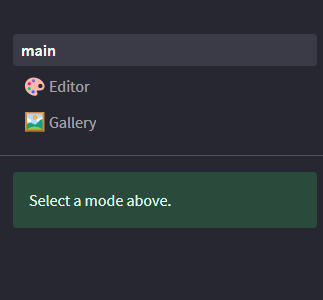
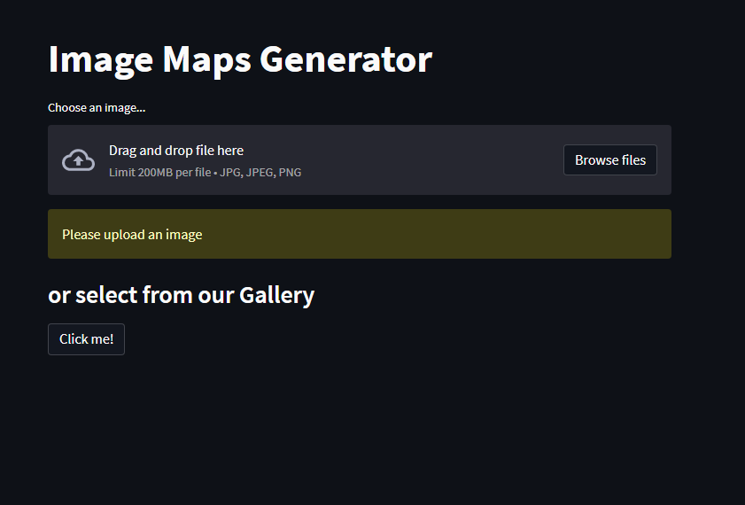

General
============

Introduction
-------------
ImageWeave is a web application developed by PyxelCollective, a group of three university students. It is a texture generation app that allows users to create maps from any image. With its simple and user-friendly interface, ImageWeave enables people with no prior knowledge of map creation to easily generate maps with just a few clicks.

Modes
--------

ImageWeave offers two modes: Upload and Gallery. The Upload section allows users to upload their own images and generate maps from them. The Gallery section displays a collection of all the generated maps.

Upload Mode
--------------

In Upload mode, users can upload their own images and choose which type of map they want to generate.

1.Upload Image: Users can select an image file from their local device using the upload option. Once the image is uploaded, it is displayed on the page.

2.Map Selection: A menu on the left side of the page allows users to choose the type of map they want to generate. This could include options like terrain maps, height maps, etc. Users can select their desired map type.

3.Category Selection: Below the image, users can choose a category for the generated map. This helps organize the maps in the Gallery section. If a category is selected, users can also provide a name and caption for the map.

4.Generate Map: After selecting the map type and providing the necessary details, users can click on the "Generate image" button to create the map. Once generated, the map is ready for upload. Just press the "Submit" button and you are good to go.

5.Gallery Redirect: There is also a button available that redirects users to the Gallery section, allowing them to view all the generated maps.

Gallery Mode
----------------
.. image:: images/gallery.png
  :width: 400
  :alt: Alternative text

In Gallery mode, users can browse and filter through the collection of generated maps.

1.Category Filter: On the left side of the page, users can find a category filter. This filter allows users to narrow down the displayed maps based on their selected category. If no category is selected, the gallery displays a list of all uploaded images.

2.Filtered Map List: Once a category is selected, only the images belonging to that category are displayed on the page. Users can scroll through the list to view the maps.

Conclusion
------------
ImageWeave provides an intuitive platform for generating maps from images. Its Upload and Gallery modes offer a seamless experience for users to upload their images, generate maps, and explore the collection of generated maps.